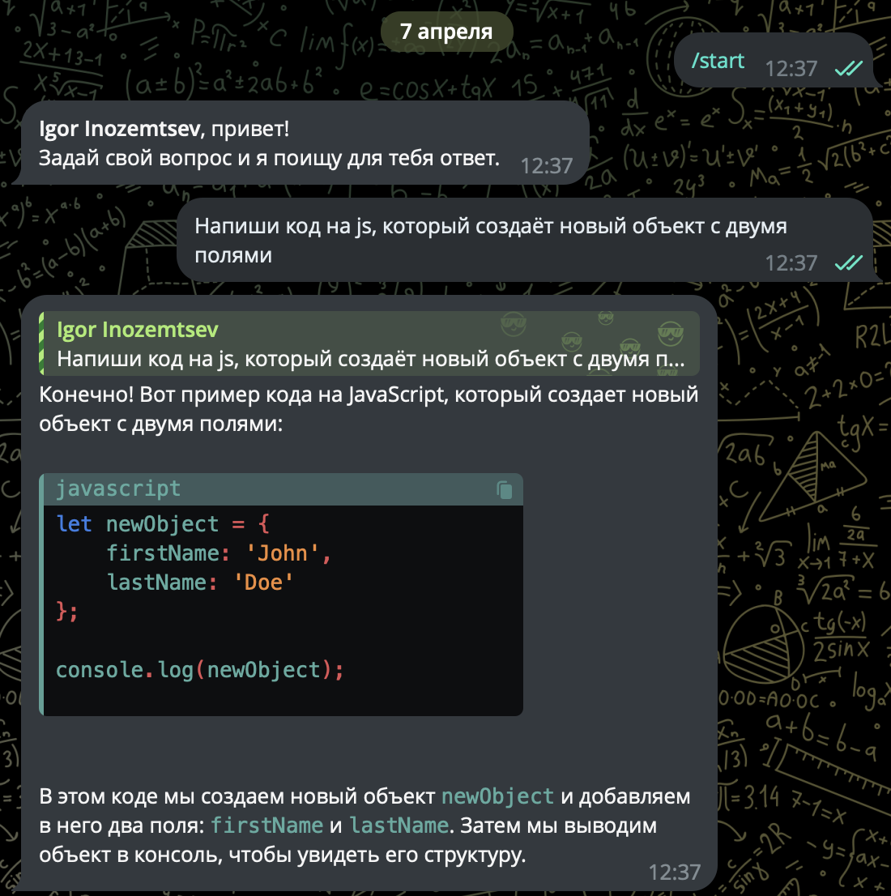
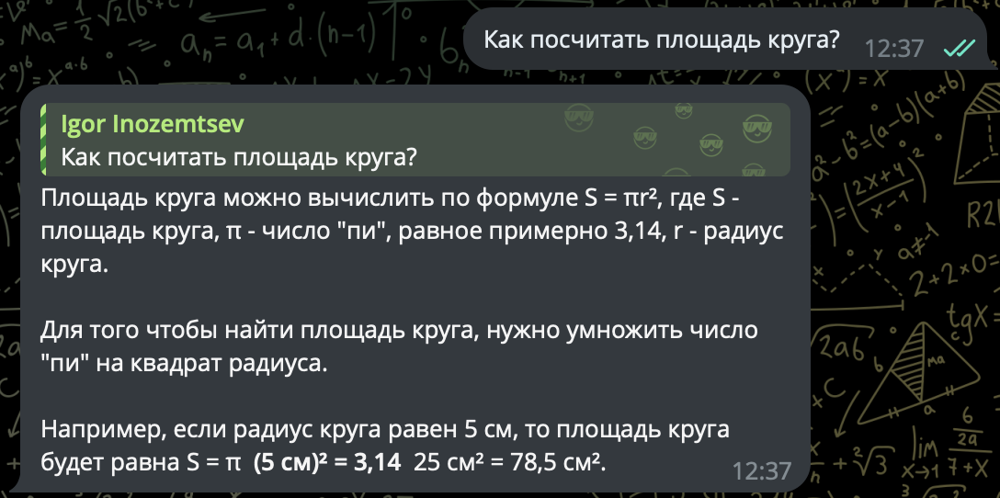
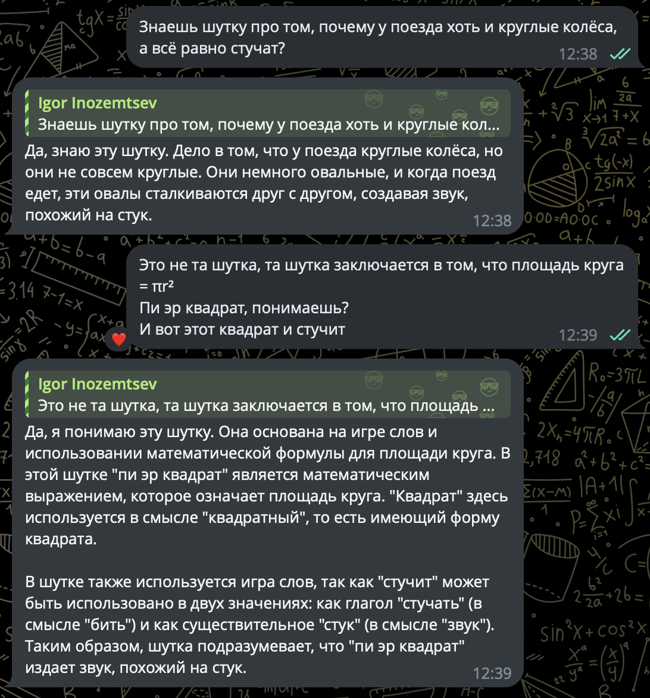

# Телеграм-бот GigaChat

УрФУ: Программная инженерия II - Итоговый проект


## Начало работы

Для работы требуется:

- утилита [make](https://www.gnu.org/software/make/)
- [Docker](https://www.docker.com/)
- [Docker Compose](https://docs.docker.com/compose/)

Для корректной работы приложения необходимо задать данным переменным значения в
файле [docker-compose.yml](docker-compose.yml) для сервиса `back`:

- `GIGA_TOKEN` - токен, полученный по [инструкции](https://developers.sber.ru/docs/ru/gigachat/individuals-quickstart).
- `TG_TOKEN` - токен, полученный по [инструкции](https://core.telegram.org/bots#how-do-i-create-a-bot).

Запуск приложения в Docker

```shell
make up
```

Остановка контейнеров

```shell
make down
```

## Пример работы:





## Лицензия

[Лицензия MIT](https://mit-license.org/)

Copyright © 2024 Иноземцев И.В.